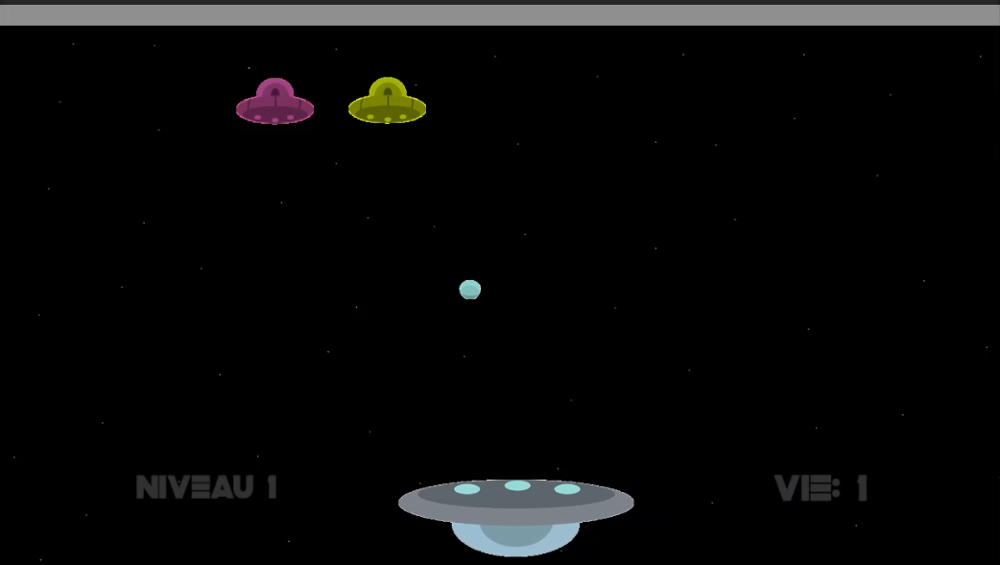
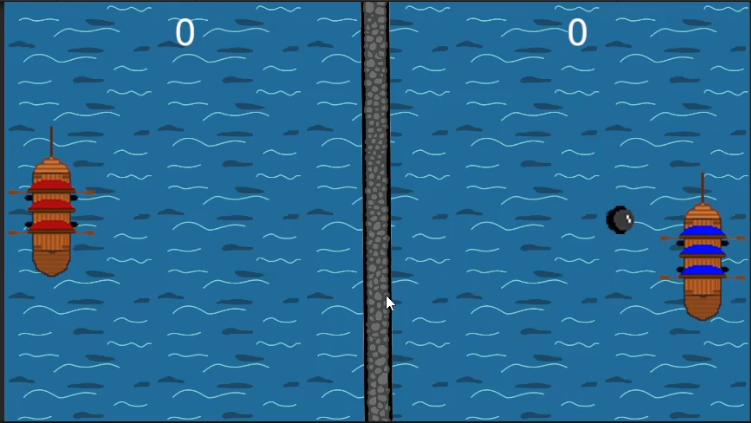
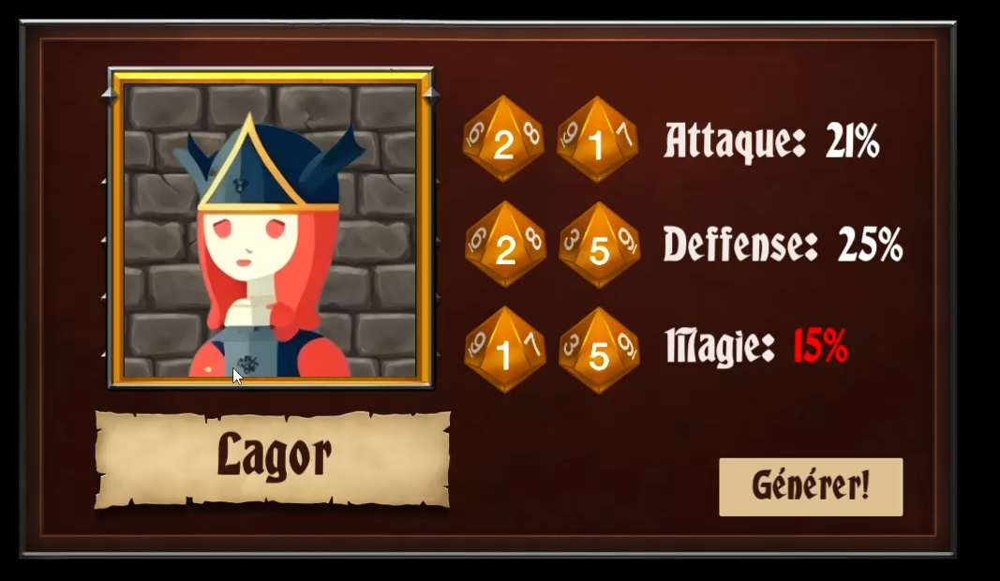

# 🕹️ Game Projects

### **Game 1 – (nom du jeu)**
- Description: A dynamic event website highlighting music shows with bold visuals and a clean, modern layout.

**Screenshot:**  

Gameplay Video: 
[🎬 Watch the .mp4 video](https://raw.githubusercontent.com/YOUR-USER/portfolio/main/web/project-1/video.mp4)
### **Game 2 – (nom du jeu)**

- Description: Another quick description. (Ex: A top-down survival game with crafting, enemies, and randomized maps.)

**Screenshot:**  

Gameplay Video:
(link to the video on GitHub – here)

### **Game 3 – (nom du jeu)**

- Description: (Ex: A 2D puzzle game where the player manipulates objects to reach the exit.)

**Screenshot:**  

Gameplay Video:
(link to the video on GitHub – here)
